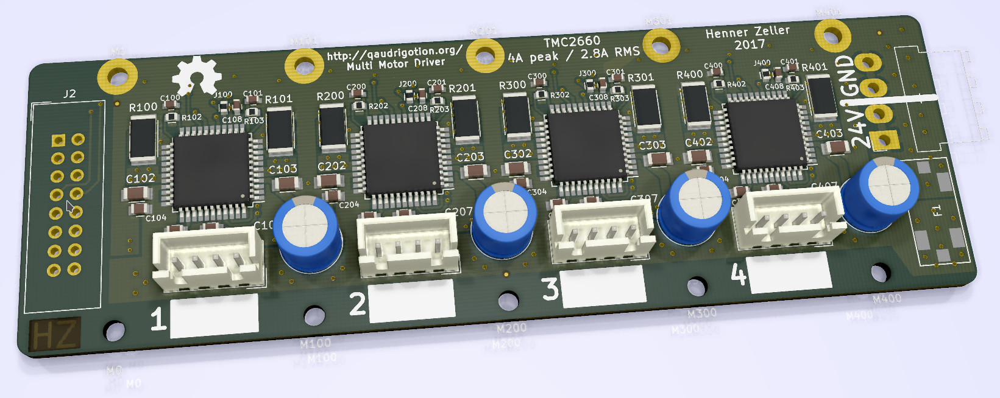

Quadrigotion: Multiple Motor Drivers, one connector
============================================================

Often it is useful to have all the motor drivers needed for a machine
on a separate circuit board to be able to mount it to a heatsink or close
to the action. This is what this project is about.
The name **Quadrigotion** is a word amalgamated from 'Quadriga' (Four
horses powering a chariot) and 'Motion'.

Motivation for this project to have motor drivers easily replacable and
testable on my various 3D printers and CNC machines. Since I am also
[developing motion control software][BeagleG], I might have an unusual
high demand for this :)

The idea is to have a common connector type, described below, and various
implementations of that concept. The first implementation is using a TMC2660,
which is the 'big brother' of the more well-known TMC2100.

Other implementations are conceivable e.g. with Pololu modules, DRV8825, or
super high current and voltage drivers for heavy CNC machines.
Implementations can be super bare-bone and not use the SPI connection or
could be configured via SPI using a shift-register and digital potentiometers
if the chips can't be configured with SPI directly.
While the first Quadrigotion implementation happens to also have four motor
drivers, this could of course extend in the future.

The Connector
--------------

The digital input is provided with an IDC connector with 16 pins (2x8) or
20 pins (2x10).
It features a SPI bus to send configuration data and also read motor/driver
status (the actual protocol is of implementation-dependent, but they all can
share the same hardware interface).

| Desc               | Pin | Pin | Desc
|-------------------:|:---:|:---:|:-----------------------------
|               GND  |   1 |   2 | VCC (3.3V-5V)
| All Motors ~Enable |   3 |   4 | (not connected; reserved for fault-out)
|          ~CS (SPI) |   5 |   6 | CLK (SPI)
|         MISO (SPI) |   7 |   8 | MOSI (SPI)
|            Step #1 |   9 |  10 | Dir #1
|            Step #2 |  11 |  12 | Dir #2
|            Step #3 |  13 |  14 | Dir #3
|            Step #4 |  15 |  16 | Dir #4 -------- END IDC 16 variant
|            Step #5 |  17 |  18 | Dir #5
|            Step #6 |  19 |  20 | Dir #6 -------- END IDC 20 variant

It is easy to see that extending the driver count would just require a wider
IDC connector; the serial configuration interface can deal with any
number. A 16 pin IDC connector allows for 4 steppers, the next configuration
with 20 pins would allow for six drivers.

A single Enable-pin is provided that affects all drivers. This makes it easy
to wire up that signal directly e.g. for emergency buttons.
If more individual control of each driver is needed, this can be done via
the SPI connection.

The fast signals for each stepper, step and dir, are provided in
a parallel input with two lines per stepper.

A Quadrigotion connector has a single ChipSelect signal; multiple drivers
on each implementation have to share that bus, e.g. by internally being
organized as a shift register that latches when ~CS goes high again.

One pin (pin 4) is not connected yet, but it is reserved for fault detection
output (e.g stalling, overheating or over-current).

In an upcoming project, I'll build a breakout board to work with [BeagleG].

TMC2660 Implementation
----------------------

The first implementation is based on the TMC2660, a feature-rich motor driver
that can drive up to 4A (2.8A RMS). The 40mmx125mm PCB is a four layer board
which duals as heat conductor for cooling. Multiple M2.5 mounting holes allow
to firmly mount it to a heatsink and get even pressure to individual silicone
heatsink pads.
Power is provided via a 4-pin JST VH connector (3.96mm pitch),
circuit protected with an automotive ATC Mini 297 blade fuse.

You find the gerbers in the [fab/](./fab) directory. Board is also
[shared on OshPark]. Cave: since this is the very first version, no
testing has been done yet with a physical board.

[BeagleG]: https://github.com/hzeller/beagleg
[shared on OshPark]: https://oshpark.com/shared_projects/Agv88Z3j
